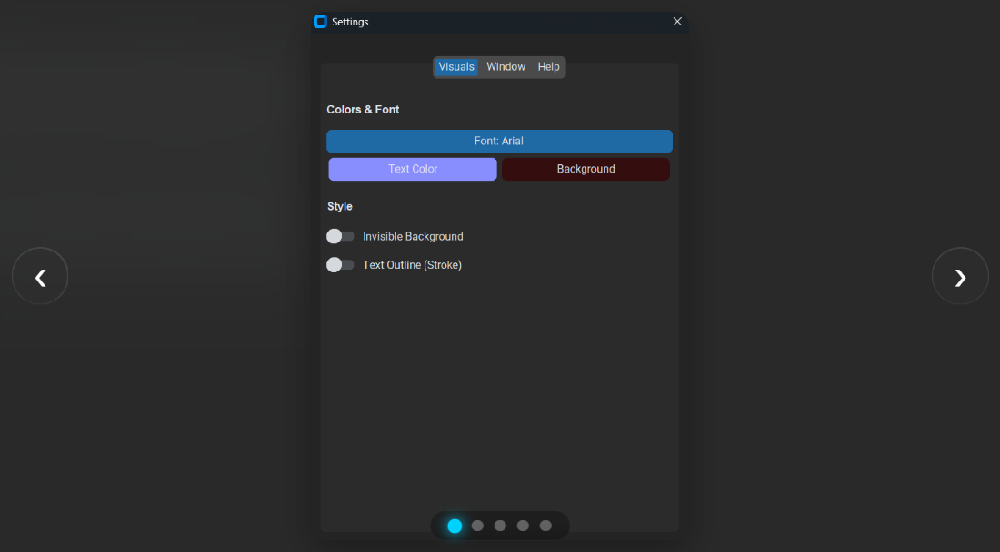

# PTT 4n+1 (Palia Tower Timer)

PTT 4n+1 is a desktop overlay utility designed for **Palia**. It synchronizes with the game server time to automatically calculate and display the next **"4n + 1"** interval. This helps with start timing for advanced tower running.


## Features

*   **Server Synchronization:** Automatically calculates the specific server tick required for timed events.
*   **Non-Intrusive Overlay:** Designed to float over gameplay without intercepting input, requiring the game to be in Windowed Fullscreen mode.
*   **Minimalist UI:**
    *   **Invisible Mode:** Option to remove the background container, displaying only floating text.
    *   **Click-Through Capability:** The timer can be repositioned by dragging the text element directly.
*   **Customization:**
    *   **Typography:** Integrated search engine for all system-installed fonts.
    *   **Color Palette:** Advanced Spectrum Picker for text and background customization.
    *   **Icons:** Native support for loading custom `.ico` and `.png` files.
 
## Gallery

<p align="center">
  Click the image below to view the interactive gallery.
  <br><br>
  <a href="https://partlycloudy24.github.io/PPT_4N-1/">
    
  </a>
</p>

## Installation

### Method 1: Windows Installer (Recommended)
This is the standard deployment method for end-users.

1.  Navigate to the **Releases** section of this repository.
2.  Download **`PTT_4n1_Installer.exe`**.
3.  Execute the installer. This will deploy the application to Program Files and create a Desktop shortcut.

### Method 2: Manual Installation (Source Code)
For developers or users who prefer running the application via a Python environment.

**Prerequisites**
*   **Python 3.10** or newer.
*   Ensure "Add Python to PATH" is selected during Python installation.

**Step 1: Clone Repository**
Download the source code or clone via git:
```bash
git clone https://github.com/Partlycloudy24/PPT_4N-1.git
cd PTT-4n1
```

**Step 2: Install Dependencies**
Open a terminal in the project directory and execute:
```bash
pip install customtkinter pillow
```

**Step 3: Launch Application**
```bash
python main.py
```

## Usage Instructions

### Game Configuration
For the overlay to render correctly over the game client, Palia must be set to **Windowed Fullscreen**.
1.  Launch Palia.
2.  Navigate to **Settings > Graphics**.
3.  Set **Window Mode** to **Windowed Fullscreen**.
    *   *Note: Exclusive Fullscreen mode will render the game over the timer.*

### Controls
*   **Reposition:** Click and drag anywhere on the timer background or text.
*   **Resize:** Hover over the timer to reveal the resize grip (bottom-right corner). Drag to adjust dimensions.
*   **Context Menu:** Right-click the timer to access the Quick Menu.

## Configuration

Right-click the timer and select **Settings** to access the configuration dashboard. Settings are persistent and saved locally.

| Setting | Description |
| :--- | :--- |
| **Typography** | Searchable list of all fonts installed on the operating system. |
| **Colors** | Modify text and background colors using the Spectrum Picker. |
| **Invisible Background** | Hides the background container for a transparent look. |
| **Text Outline** | Adds a high-contrast stroke to text (Recommended for Invisible Mode). |
| **Lock Position** | Disables window dragging to prevent accidental movement. |
| **Custom Icon** | Upload a custom `.ico` or `.png` file to replace the application window icon. |

## Troubleshooting

**Timer appears blank or small on startup**
The application auto-calibrates layout on launch. If the display is incorrect, drag the resize handle (bottom-right) slightly to force a layout refresh.

**Settings are not saving**
Configuration files are stored in the local AppData directory (`%APPDATA%\PaliaTimer`). Ensure the application has standard write permissions for this folder.

**Unable to interact with game elements behind the timer**
The application is set to "Always on Top" by default. If it obstructs game UI, right-click the timer, navigate to **Settings > Window**, and disable "Always on Top".

## License and Legal

**Copyright © 2025 Clouay.**
This project is licensed under the [MIT License](https://github.com/Partlycloudy24/PTT_4n-1/blob/main/LICENSE).

**Disclaimer**

This software is an unofficial fan-made utility. It is not endorsed by, affiliated with, sponsored by, or specifically approved by Singularity 6 Corporation. Palia is a trademark of Singularity 6 Corporation. All rights reserved. This tool functions strictly as a system clock overlay and does not interact with game files or memory.


